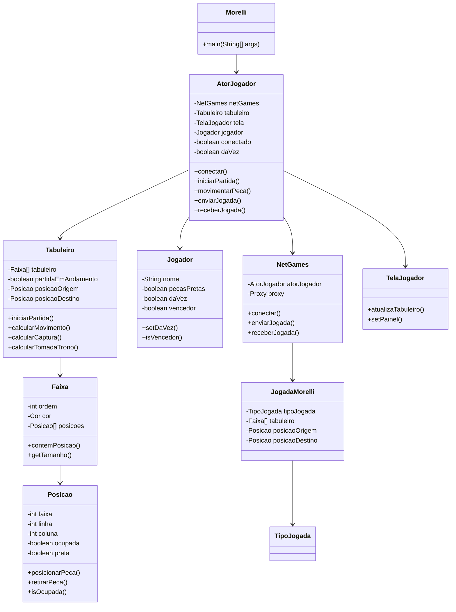
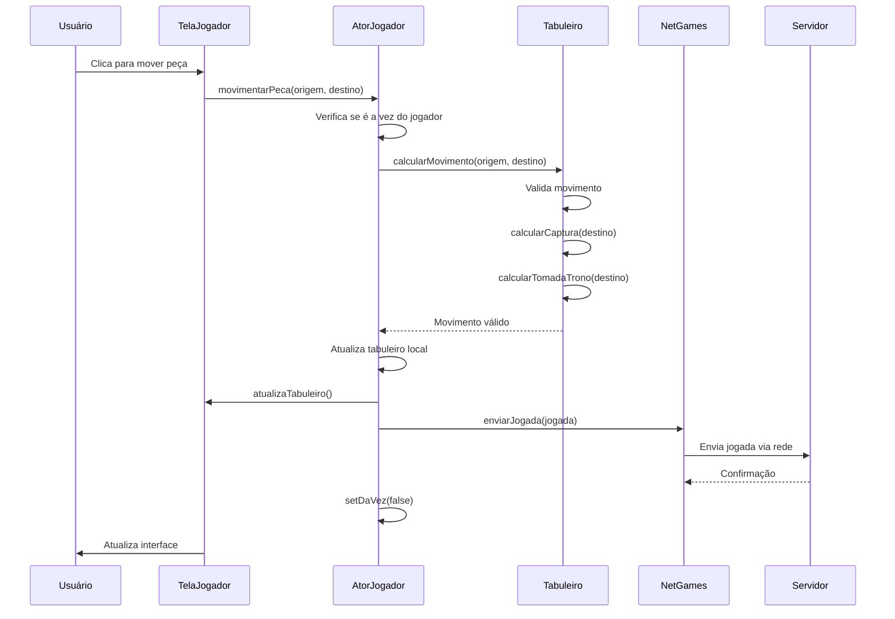
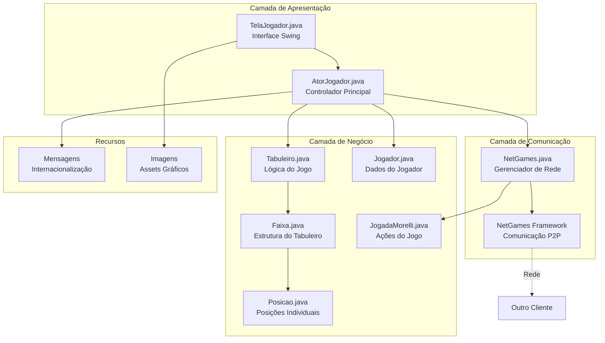

# Análise do Sistema Legado Morelli

## 1. Coleta de Informações

### 1.1 Documentação Disponível

#### (a) Diagramas UML, requisitos, manuais técnicos
- **Status**: Não encontrados diagramas UML formais
- **Documentação**: README.md básico com descrição geral
- **Manuais**: Ausentes
- **Requisitos**: Inferidos através do código e comentários

#### (b) Scripts de banco de dados (MER, SQL)
- **Status**: Não utiliza banco de dados tradicional
- **Persistência**: Sistema utiliza comunicação em rede via NetGames Framework
- **Dados**: Estado do jogo mantido em memória durante a partida

#### (c) Comentários e logs de execução
- **Comentários**: Limitados, principalmente em português
- **Logs**: Configuração básica via Log4j (server.properties)
- **Documentação inline**: Mínima, focada em TODOs

### 1.2 Estrutura Geral do Sistema

#### (a) Arquitetura utilizada
```
Morelli/
├── src/
│   ├── entidades/           # Camada de Domínio
│   │   ├── Tabuleiro.java
│   │   ├── Faixa.java
│   │   ├── Posicao.java
│   │   ├── Jogador.java
│   │   └── NetGames.java
│   ├── interfaceGrafica/    # Camada de Apresentação
│   │   ├── AtorJogador.java
│   │   └── TelaJogador.java
│   ├── mensagens/           # Internacionalização
│   └── morelli/            # Ponto de entrada
└── dist/                   # Distribuição
```

**Padrão Arquitetural**: MVC adaptado para jogos
- **Model**: Classes em `entidades/`
- **View**: Classes em `interfaceGrafica/`
- **Controller**: `AtorJogador.java`

#### (b) Tecnologias empregadas
- **Linguagem**: Java 8
- **GUI**: Swing
- **IDE**: NetBeans 8.2
- **Build**: Apache Ant
- **Rede**: NetGames Framework (proprietário)
- **Logging**: Log4j
- **Internacionalização**: ResourceBundle

#### (c) Principais classes, métodos e dependências

**Classes Principais**:
1. `Tabuleiro.java` - Lógica central do jogo
2. `AtorJogador.java` - Controlador principal
3. `NetGames.java` - Comunicação em rede
4. `Faixa.java` - Representação das faixas do tabuleiro
5. `Posicao.java` - Posições individuais

**Dependências Externas**:
- NetGames Framework (ngnrtFramework.jar)
- NetBeans DataBinding
- Log4j (implícito)

### 1.3 Pontos de Atenção Identificados

1. **Framework Proprietário**: Dependência do NetGames pode ser descontinuado
2. **Tecnologia Legada**: Swing é considerado obsoleto
3. **Falta de Testes**: Nenhum teste automatizado identificado
4. **Documentação Limitada**: Comentários insuficientes
5. **Acoplamento Alto**: Classes fortemente acopladas
6. **Tratamento de Erros**: Inconsistente e limitado

## 2. Análise Estática

### 2.1 Inspeção do Código-fonte

#### (a) Variáveis e métodos não utilizados

**Em Tabuleiro.java**:
```java
// Variáveis não utilizadas
protected Faixa trono; // Declarada mas pouco utilizada
protected AtorJogador proximoJogador; // Lógica incompleta

// Métodos não implementados
public void setAdjacentes() // TODO não implementado
public Posicao verificarAdjacentes(Posicao adjacente) // TODO
public boolean verficarCaminho(Posicao origem, Posicao destino) // TODO
```

**Em Posicao.java**:
```java
// Variáveis não utilizadas
protected Posicao[][] adjacentes; // Nunca inicializada
protected Jogador jogador; // Pouco utilizada

// Métodos não implementados
public void setAdjacentes() // TODO
public boolean possuiAdjacentesCorOposta(Posicao posicao) // TODO
```

**Em ImagemDeTabuleiro.java**:
```java
// Classe inteira não implementada - apenas TODOs
public void assumirMensagem(String mensagem) // TODO
public void assumirValor(int linha, int coluna, int valor) // TODO
public void assumirPlacar(String placar) // TODO
```

#### (b) Código morto e/ou código duplicado

**Código Morto**:
- Classe `ImagemDeTabuleiro.java` - completamente não implementada
- Métodos com apenas `throw new UnsupportedOperationException()`
- Comentários de código antigo em `AtorJogador.java`

**Código Duplicado**:
```java
// Padrão repetido em AtorJogador.java
JOptionPane.showMessageDialog(tela, msg);
// Aparece em múltiplos métodos sem abstração

// Lógica similar de validação em Tabuleiro.java
if (posicao.isOcupada()) {
    // Padrão repetido em vários métodos
}
```

#### (c) Uso incorreto de padrões e convenções

**Problemas Identificados**:
1. **Nomenclatura**: Mistura português/inglês
2. **Visibilidade**: Uso excessivo de `protected` em vez de `private`
3. **Exception Handling**: Catch genérico `Exception e`
4. **Magic Numbers**: Valores hardcoded (7 faixas, 48 peças)
5. **Responsabilidade Única**: Classes fazem múltiplas coisas

**Exemplos**:
```java
// Nomenclatura inconsistente
public void movimentarPeca() // português
public boolean isOcupada() // inglês

// Visibilidade inadequada
protected String nome; // deveria ser private

// Magic numbers
this.tabuleiro = new Faixa[7]; // deveria ser constante
```

#### (d) Código de alta complexidade

**Métodos Complexos em Tabuleiro.java**:

1. **`distribuiPecas()`** - Complexidade Cognitiva Alta
```java
// Lógica confusa com Random e loops aninhados
for (int i = 0; i <= 23; i++) {
    Random random = new Random();
    int x = random.nextInt(2);
    if (x == 0) {
        // Lógica complexa de distribuição
    }
}
```

2. **`verificarAdjacentes()`** - Complexidade Ciclomática Alta
```java
// Múltiplos loops aninhados e condicionais
for (Posicao posicao : posicoes) {
    if (posicao != null) {
        if (posicao.isOcupada() && posicao.getCor() != cor) {
            if (posicao.getLinha() == linha - 1 && posicao.getColuna() == coluna - 1) {
                // 8 condições similares
            }
        }
    }
}
```

3. **`calcularCaptura()`** - Lógica Complexa
```java
// Múltiplos níveis de aninhamento
for (int i = 0; i < posicoes.length; i++) {
    for (int j = 0; j < adjacentes.length; j++) {
        if (adjacente != null) {
            if (destino.equals(adjacente)) {
                // Lógica complexa
            }
        }
    }
}
```

#### (e) Dependências desnecessárias

**Dependências Questionáveis**:
- `NetBeans DataBinding` - Pode não ser necessário
- Múltiplos JARs do NetGames - Possível redundância
- `DataBindingME-SVG` - Não utilizado aparentemente

### 2.2 Análise de Dependências

#### (a) Pacotes, frameworks e bibliotecas

**Dependências Críticas**:
```xml
<!-- Do project.properties -->
NetGamesFileOffline.jar
ngnrtFramework.jar
servidor.jar
NetBeans DataBinding (3 variações)
```

**Problemas**:
1. **Vendor Lock-in**: NetGames Framework proprietário
2. **Versões Antigas**: NetBeans 8.2 (descontinuado)
3. **Dependências Transitivas**: Não documentadas

#### (b) Acoplamento e modularidade

**Alto Acoplamento**:
- `AtorJogador` conhece todas as outras classes
- `Tabuleiro` diretamente acoplado à `AtorJogador`
- `NetGames` fortemente acoplado ao framework

**Baixa Modularidade**:
- Lógica de negócio misturada com apresentação
- Sem interfaces ou abstrações
- Dificuldade para testes unitários

### 2.3 Avaliação de Complexidade - Classe Tabuleiro

#### Análise de Complexidade Computacional

**Métodos Analisados**:

1. **`iniciarPartida()`** - **O(1)**
```java
// Operações constantes: criação de objetos, atribuições
public Faixa[] iniciarPartida(Jogador jogador, int ordem, String nomeJogador1, String nomeJogador2)
```

2. **`limparTabuleiro()`** - **O(1)**
```java
// Loop fixo de 7 iterações
for (int i = 0; i < 7; i++) {
    Faixa faixa = new Faixa(i);
    this.tabuleiro[i] = faixa;
}
```

3. **`distribuiPecas()`** - **O(1)**
```java
// Loop fixo de 24 iterações
for (int i = 0; i <= 23; i++) {
    // Operações constantes
}
```

4. **`calcularMovimentoLinha()`** - **O(n)**
```java
// Loop através das faixas (máximo 7) e posições por faixa
for (int i = faixaAtual; i > 0; i--) {
    Posicao[] posicoesFaixa = tabuleiro[faixaAtual].getPosicoes();
    for (int j = 0; j < posicoesFaixa.length; j++) {
        // n = número total de posições nas faixas
    }
}
```

5. **`calcularMovimentoColuna()`** - **O(n)**
```java
// Mesma estrutura que calcularMovimentoLinha()
```

6. **`calcularMovimentoDiagonal()`** - **O(1)**
```java
// Apenas cálculos matemáticos simples
int diagonalOrigem = linhaOrigem - colunaOrigem;
int diagonalDestino = linhaDestino - colunaDestino;
```

7. **`verificarAdjacentes()`** - **O(n)**
```java
// Loop através de 3 faixas, cada uma com suas posições
// n = número total de posições nas 3 faixas adjacentes
```

8. **`calcularCaptura()`** - **O(n²)**
```java
// Loop através de adjacentes (8) para cada posição adjacente
Posicao[] posicoes = verificarAdjacentes(destino); // O(n)
for (int i = 0; i < posicoes.length; i++) { // 8 iterações
    Posicao[] adjacentes = verificarAdjacentes(posicao); // O(n)
    for (int j = 0; j < adjacentes.length; j++) { // 8 iterações
        // Resultado: O(n²)
    }
}
```

9. **`calcularTomadaTrono()`** - **O(n)**
```java
// Loop através das posições de uma faixa
Posicao[] posicoes = tabuleiro[faixa].getPosicoes();
for (int i = 0; i < posicoes.length; i++) {
    // n = número de posições na faixa
}
```

10. **`calcularMovimento()`** - **O(n)**
```java
// Chama métodos O(n): calcularMovimentoLinha, calcularMovimentoColuna, calcularMovimentoDiagonal
// Complexidade dominante: O(n)
```

**Resumo de Complexidades**:
- **O(1)**: `iniciarPartida()`, `limparTabuleiro()`, `distribuiPecas()`, `calcularMovimentoDiagonal()`
- **O(n)**: `calcularMovimentoLinha()`, `calcularMovimentoColuna()`, `verificarAdjacentes()`, `calcularTomadaTrono()`, `calcularMovimento()`
- **O(n²)**: `calcularCaptura()`

**Onde n representa o número total de posições no tabuleiro (aproximadamente 168 posições)**

## 3. Modelagem e Abstração

### 3.1 Diagramas UML

#### (a) Diagrama de Classes - Principais Entidades



#### (b) Diagrama de Sequência - Fluxo de Movimentação



#### (c) Diagrama de Componentes - Arquitetura Geral



### 3.2 Abstração da Arquitetura

#### (a) Camada de Apresentação
**Responsabilidades**:
- Interface gráfica com Swing
- Captura de eventos do usuário
- Exibição do estado do jogo
- Internacionalização

**Componentes**:
- `TelaJogador.java` - Interface principal
- `AtorJogador.java` - Controlador (híbrido)
- Arquivos de mensagens (i18n)

**Problemas Identificados**:
- Lógica de negócio misturada no controlador
- Acoplamento forte com Swing
- Falta de separação clara MVC

#### (b) Camada de Negócio
**Responsabilidades**:
- Regras do jogo Morelli
- Validação de movimentos
- Cálculo de capturas
- Estado da partida

**Componentes**:
- `Tabuleiro.java` - Lógica central
- `Faixa.java` - Estrutura do tabuleiro
- `Posicao.java` - Posições individuais
- `Jogador.java` - Dados dos jogadores
- `JogadaMorelli.java` - Representação de jogadas

**Problemas Identificados**:
- Falta de interfaces/abstrações
- Métodos não implementados
- Complexidade alta em alguns métodos
- Acoplamento com camada de apresentação

#### (c) Camada de Persistência
**Status**: Não implementada tradicionalmente

**Observações**:
- Sistema não utiliza banco de dados
- Estado mantido em memória durante partida
- Comunicação via rede para sincronização
- Sem persistência de histórico ou estatísticas

**Componentes de Comunicação**:
- `NetGames.java` - Wrapper do framework
- NetGames Framework - Comunicação P2P
- Serialização de objetos para rede

## 4. Recomendações para Modernização

### 4.1 Arquitetura
1. **Implementar Clean Architecture**
2. **Separar completamente as camadas**
3. **Introduzir interfaces e abstrações**
4. **Implementar injeção de dependências**

### 4.2 Tecnologia
1. **Migrar de Swing para JavaFX ou Web**
2. **Substituir NetGames por WebSockets**
3. **Implementar testes automatizados**
4. **Adicionar sistema de build moderno (Maven/Gradle)**

### 4.3 Código
1. **Refatorar métodos complexos**
2. **Implementar métodos TODO**
3. **Melhorar tratamento de erros**
4. **Padronizar nomenclatura**
5. **Adicionar documentação JavaDoc**

### 4.4 Funcionalidades
1. **Implementar persistência de dados**
2. **Adicionar sistema de ranking**
3. **Melhorar interface do usuário**
4. **Implementar replay de partidas**